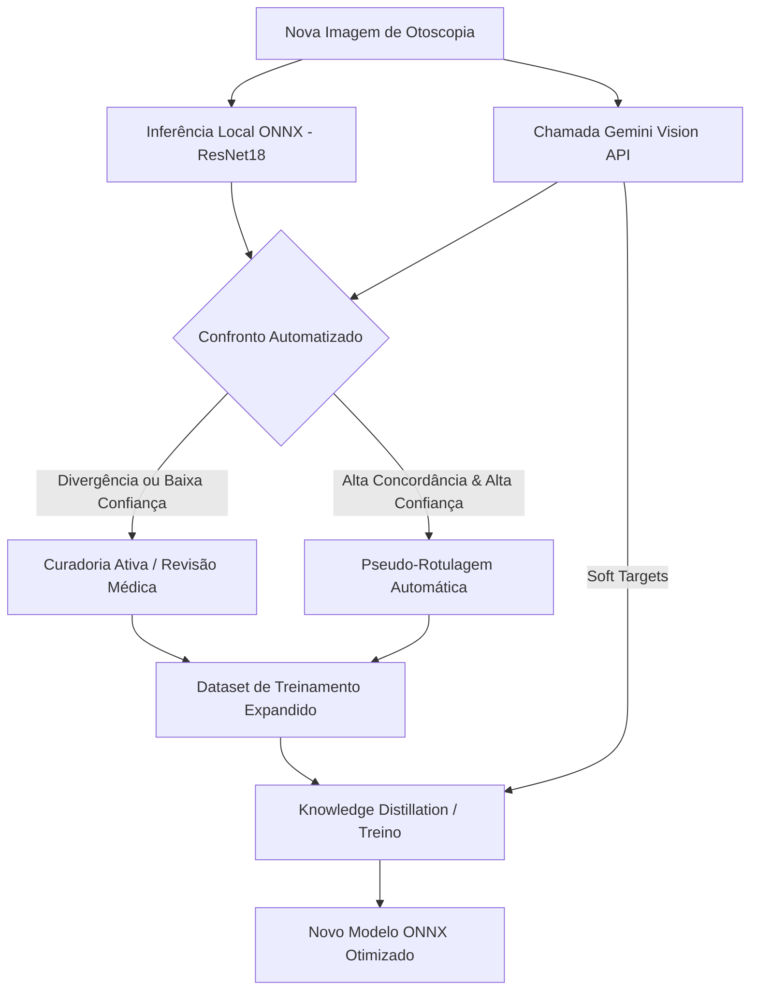

# Plano de Confronto com Gemini Vision: MLOps e Polimento do Modelo ONNX

Este documento detalha o plano estratégico e técnico para usar o **Gemini Vision API** como balizador, oráculo de validação e refinador pós-modelo para otimizar os modelos locais de aprendizagem profunda (**ResNet18 ONNX**, **ConvNeXt-Tiny**, **EfficientNet-B2**) no ecossistema **OTTO ATLAS**.

> [!IMPORTANT]
> **Premissa Estratégica Central:** O Gemini Vision API **NUNCA** é treinado ou modificado neste processo. O Gemini Vision atua estritamente como um oráculo de rotulagem e filtro pós-modelo. O valor proprietário e de produto do OTTO reside inteiramente nos modelos locais compactos executados de forma ágil e offline no frontend ou em instâncias leves, garantindo independência tecnológica.

---

## 🩺 Alinhamento Estratégico: O Modelo Local como Produto

O refinamento contínuo e a apresentação de predições do OTTO ATLAS são orientados pelas seguintes diretrizes de negócio e usabilidade clínica:

### A. Foco Pedagógico (Médicos Generalistas e Estudantes)
* **Objetivo de Assertividade:** A predição não deve apenas fornecer uma classe seca, mas sim uma sugestão clínica explicativa e confiável. O produto é desenhado para apoiar o raciocínio de estudantes de medicina, residentes e otorrinolaringologistas não-especialistas.
* **Exibição Pós-Modelo:** O confronto automatizado com modelos multimodais de visão serve como um filtro de controle de qualidade posterior. Caso o modelo local apresente divergência alta contra o Gemini Vision, a UI pode suavizar as probabilidades e sugerir cautela ("Diferenciais em consideração"), prevenindo erros diagnósticos em ponta operada.

### B. Visão de Futuro (OTOSCOP-IA v2)
* **Mapeamento Clínico Avançado:** Inspirado nas metodologias de segmentação fina e classificação do artigo de **Sumatosima** (arquivado nas referências do ecossistema), a versão v2 do OTOSCOP-IA evoluirá para além da classificação simples.
* **Detecção Anatômica:** O objetivo futuro será detectar detalhes estruturais da membrana timpânica (cabo do martelo, triângulo luminoso, presença de retrações, abaulamentos, hiperemias e perfurações) gerando descrições textuais ricas combinadas com a saída do modelo local. No momento, o foco permanece em atingir e manter a máxima acurácia nas 9 classes de triagem.

---

## 🧠 Como o Confronto com o Gemini Vision Melhora o Nosso Modelo ONNX

O confronto automático e a comparação com o Gemini Vision servem como um balizador do nosso classificador leve local no ciclo de MLOps:

### 1. Active Learning (Curadoria Ativa)
Imagens em que a **ResNet18 local** e o **Gemini Vision** divergem em suas predições diagnósticas principais são automaticamente classificadas como candidatos prioritários para revisão por otorrinolaringologistas.
* **Benefício:** O tempo dos especialistas clínicos é focado estritamente em imagens limítrofes, raras ou ambíguas, eliminando o esforço de anotação redundante em imagens óbvias de otoscopia normal ou cerume espesso.

### 2. Knowledge Distillation (Destilação de Conhecimento)
Usamos a distribuição de probabilidade gerada pelo Gemini Vision como *soft targets* (alvos suaves) no treinamento dos modelos locais.
* **Benefício:** Ao invés de treinar a ResNet18 apenas com rótulos rígidos (*hard labels* como `0` ou `1`), a rede pequena aprende a representação de incertezas e a proximidade morfológica de certas doenças (por exemplo, a sutil diferença visual entre uma Otite Média Serosa leve e uma Membrana Timpânica Normal retraída), herdando a capacidade de generalização do modelo maior.

### 3. Pseudo-rotulagem Automática
Imagens em que ambos os modelos coincidem com alta confiança (ex: ambos diagnosticam *Cerume* com probabilidade $> 85\%$) recebem pseudo-rótulos automáticos.
* **Benefício:** Essas imagens são adicionadas diretamente ao repositório de treinamento sem intervenção humana, permitindo o escalonamento exponencial do volume do dataset a custo quase zero.

### 4. Descoberta e Mitigação de Vieses Clínicos
O monitoramento contínuo gera uma matriz de confusão comparativa. Identificamos se a ResNet18 erra consistentemente em classes específicas (como confundir *Otite Externa Aguda* com *Tímpano Esclerosado* devido a variações de iluminação) onde o Gemini Vision demonstra acertos estáveis.
* **Benefício:** Direciona a coleta específica de mais dados dessas classes e orienta a aplicação de técnicas agressivas de aumento de dados (*data augmentation* direcionado), como balanceamento de brilho, distorções espaciais e rotação.

---

## 🛠️ Arquitetura Técnica do Confronto

O script `model_benchmarker.py` realiza o mapeamento comparativo. Para automatizar o processo, o pipeline de MLOps deve seguir as especificações abaixo:

### 1. Métricas de Concordância (Certeza Coletiva)
Para calcular a consistência entre a predição local e a do Gemini Vision, utilizamos a entropia cruzada ponderada e uma fórmula de concordância de predição:

$$Certeza\\ Coletiva = \sum_{c \in Classes} (P_{ResNet}(c) \times P_{Gemini}(c))$$

* Valores de **Certeza Coletiva** próximos a $1.0$ indicam forte acordo nas principais classes.
* Valores próximos a $0.0$ indicam divergência absoluta.

### 2. Roteador de Decisão de MLOps
O pipeline em Python deve categorizar cada imagem analisada em um dos seguintes fluxos:

| Condição | Ação do Pipeline | Destino do Dado |
| :--- | :--- | :--- |
| Predição Local $\approx$ Gemini (Ambos $>80\%$) | Pseudo-Rotulação | Reincorporar diretamente ao dataset de treino (`/data/auto_labeled/`) |
| Predição Local $\neq$ Gemini (Divergência) | Encaminhamento | Fila de auditoria médica humana (`/data/audit_queue/`) |
| Baixa Confiança Geral (Ambos $<50\%$) | Descarte ou Auditoria | Fila de curadoria manual de ruído (`/data/discard_queue/`) |

---

## 🚀 Cronograma de Implementação e Polimento de Treino

### Fase 1: Coleta e Mapeamento Inicial (Em Execução)
* Executar testes em lotes de otoscopia para gerar logs de benchmark contínuos.
* Persistir os relatórios de concordância coletiva no banco de dados para auditar a assertividade da ResNet18 atual (`resnet18_model.onnx`).

### Fase 2: Implementação do Pipeline de Destilação
* Desenvolvimento de scripts de treinamento usando as saídas da API do Gemini Vision como penalidade de perda baseada em Divergência de Kullback-Leibler ($D_{KL}$).

### Fase 3: Integração com Interface de Auditoria (OTTO ATLAS Frontend)
* Disponibilizar na tela do médico uma fila visual de "Casos Divergentes" para que o profissional possa resolver o conflito com um único clique, aprimorando continuamente o banco de dados curado.
